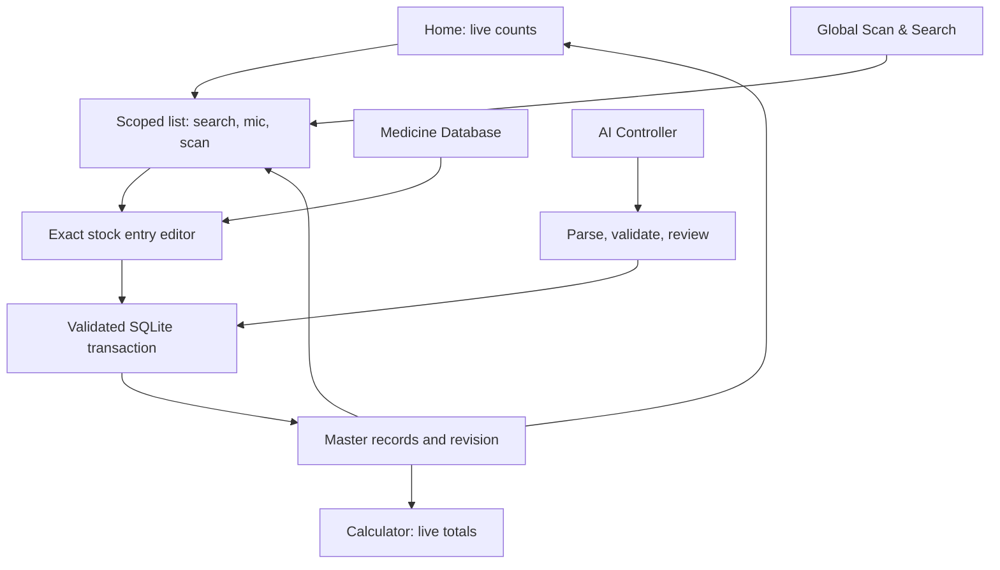

# Aaris Pharmacy — architecture and implementation map

## Repository inspection

The authorized repository is `warishakhan3548-hash/updating-repository`, branch
`main`. Baseline `7b7ce25b0621c7c4fbe653e961fb5f9ea7a1be5f` is an empty tree,
committed as “clean repository for new project”. There is no existing application
to patch. Earlier Dairy source was inspected read-only for the TXT + prompt +
reviewed JSON workflow. This is a separate application and data store.

## Dependency map

| Layer / files | Owns | Depends on |
| --- | --- | --- |
| `lib/main.dart`, `lib/app.dart` | Bootstrap, app lifecycle, navigation, theme | controller, screens |
| `lib/domain/medicine.dart` | Stored stock facts, strict dates, paise, settings | Dart only |
| `lib/domain/inventory.dart` | Expiry classification, scoped views, statistics | medicine |
| `lib/domain/search.dart` | Normalization, medical chunks, indexed fuzzy ranking | medicine, inventory |
| `lib/domain/ai_protocol.dart` | Pharmacy-only interchange, validation, change plans | medicine |
| `lib/data/inventory_database.dart` | SQLite schema, atomic writes, archive, undo, replay receipts | sqflite |
| `lib/state/pharmacy_controller.dart` | Serialized commands, reactive state, day rollover, search worker | database, domain |
| `lib/services/` | Camera/OCR/barcode, speech, AI API, export, secure key | platform packages |
| `lib/ui/` | Home, scoped search, editor, AI review, statistics, profile | controller |

There is one master set of stock records. Lists contain IDs, never independent
copies to update. A commit publishes state only after SQLite succeeds. Date
rollover and app resume trigger recalculation without modifying medicine facts.
Search responses are generation-bound; older work cannot replace newer results.

## Visual and state map

Bottom navigation: Home / Database / AI / Calculator / Profile. Global scan and
search is a prominent Home action. Each database/category search has typing,
microphone and scanner entry points. Search itself is read-only. A result opens
the editor by stock ID, retaining the originating scope on Back.

## Facts and derived rules

- Required: medicine name. Optional: brand, salt, strength, form, MFG, expiry,
  quantity, unit price, barcode, block/row/vertical, location, OCR text, notes.
- Every stock entry has an internal ID and revision. Different expiries or
  locations remain separate entries even for the same medicine. No artificial
  Batch A / B labels are shown.
- Dates are local civil dates. Expiry today means 0 days left; expired starts the
  following day. A month-only printed expiry is explicitly represented as the
  last day of that month. MFG is informational and cannot be after expiry.
- Classification precedence: archived (hidden) / sold / expired / short warning /
  month warning / normal. Short and month dashboard categories are disjoint.
- Month windows intentionally use 30 days per selected month, matching the user's
  2 months = 60 days examples. The settings UI states this convention.
- Red perimeter fraction is `clamp(1 - daysLeft / selectedWindow, 0, 1)`.
  Expired is fully red; sold is permanently amber. Color is accompanied by text.
- Warnings sort by ascending days left. Recently expired entries sort first.
  Search relevance takes precedence across different medicines; equal matches
  sort by nearest expiry. No expiry means no expiry warning.
- Sold is explicit out-of-stock confirmation, not inferred sales. Repeated Sold
  is idempotent. Quantity becomes zero; prior quantity and price are captured.
  Restock edits the existing entry with new dates/quantity and clears Sold.
- Remove archives the record from all active/search/statistic views. Activity and
  guarded Undo retain history. Expiry by itself never removes anything.
- Unit price is an integer number of paise. Inventory value uses known quantity
  multiplied by known unit price. Missing coverage is shown separately. Sold
  value is labelled an estimate from marked-sold stock, never confirmed revenue.
- Unique medicine identities include normalized name, strength and form. Salts
  normalize case/spacing, not fuzzy spelling. Form totals distinguish entries
  from known units; mixed forms are not silently treated as equivalent units.

## Search contract

Typing, OCR and mic share one engine. Apply scope before retrieval and ranking.
Exact barcodes return all matching stock entries, not an arbitrary batch. Names,
brands and salts outweigh OCR, notes and locations. Strength and numeric product
codes are preserved; dosage numbers are not indiscriminately deleted. Ordered
subsequence and edit similarity handle missing/reordered letters, with bounded
candidates and work in an isolate. Bulk text is split into medicine-like chunks.
Uncertain matches remain suggestions and never mutate/select a record silently.

## AI contract

Export contains pharmacy facts and a strict versioned prompt; no credentials or
other-app data. Both external-AI paste and supported API requests feed the same
parser, validation and readable diff review. Records/notes are untrusted data.
Existing entries require exact IDs; name similarity may suggest a match but may
not authorize a destructive action. Reject unknown fields/paths, calculated
statuses, malformed dates, negative money/quantity, missing targets, duplicate
targets, stale snapshots and replayed request IDs.

Prepare changes in groups of 25 with progress/cancellation; commit the selected
approved plan atomically. Cancellation before commit leaves the DB unchanged.
Persist a receipt with the transaction so retries cannot double-add records.
Keys use OS secure storage. An external provider is contacted only when the user
chooses to send. Gemini and an HTTPS OpenAI-compatible endpoint are supported;
arbitrary incompatible API protocols are not claimed to work.

## Validation targets and ripple effects

Domain checks cover midnight/leap dates, missing values, disjoint scopes, stock
identity, price snapshots, strength conflicts, broken words, bulk text, AI stale
plans and invalid operations. Database checks cover atomic commit/rollback,
archive/undo and durable replay protection. Widget checks cover navigation,
live counts, form validation, narrow screens and large text. Android hardware
validation remains necessary for actual camera focus, OCR, microphone permissions
and vendor speech service behavior. No 1 ms OCR or perfect matching guarantee.

## Sources consulted

- https://docs.flutter.dev/app-architecture/design-patterns/offline-first
- https://developer.apple.com/design/human-interface-guidelines/accessibility
- https://m3.material.io/foundations/designing/structure
- https://developers.google.com/ml-kit/vision/text-recognition/v2/android
- https://developer.android.com/reference/android/speech/SpeechRecognizer

## Checkpoint policy

Work directly on the requested `main` branch. Push coherent checkpoints during
the active implementation session, approximately every ten minutes, and a final
verified checkpoint. Never force-push over concurrent changes. Record progress
and remaining validation in `docs/PROGRESS.md` so an interrupted session can
resume from durable source. No recurring background task persists after work ends.
