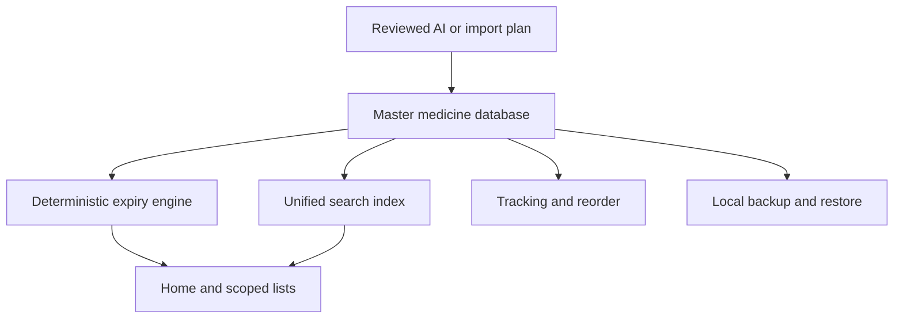

# Aaris Pharmacy — architecture and product contract

This document is the implementation contract for the consolidated product brief.
When older notes disagree, this document and the current domain tests win.

## Core boundary

The app owns one set of medicine stock records in local SQLite. Expired, SOLD,
day-warning and month-warning lists never own copies of a medicine. They are
live, mutually exclusive projections over the same records. A successful
transaction updates the controller once and every listening screen rerenders.

Bottom navigation is **Home / Database / AI / Calculator / Profile**. Results open
the exact invisible stock ID; they never repeat a name search to find an editor.

## Layer map

| Layer | Responsibility |
| --- | --- |
| `domain/medicine.dart` | Strict stored medicine facts, civil dates, paise and normalized identity |
| `domain/inventory.dart` | Status precedence, warning perimeter, scopes and inventory totals |
| `domain/search.dart` | Medical normalization, bounded index, candidate retrieval, deep fuzzy ranking and confidence |
| `domain/medicine_understanding.dart` | Layout-aware OCR fusion, private local knowledge and safe draft extraction |
| `domain/model_catalogue.dart`, `services/model_catalogue_service.dart` | Live provider discovery, validated pagination, exact repository/file links and immutable download manifests |
| `domain/gguf_metadata.dart`, `services/gguf_inspector.dart` | Bounded GGUF inspection and device-aware weight/KV/context budgets |
| `services/local_ai_runtime.dart`, `third_party/lib_llama_cpp` | One inference lease, exact prompt token limits and continuous UTF-8 token decoding |
| `domain/tracking.dart` | Privacy-safe sale events, period movement and reorder suggestions |
| `domain/ai_protocol.dart` | Pharmacy-only export and strict reviewed mutation protocol |
| `domain/backup.dart` | Versioned full-backup envelope and restore validation |
| `data/inventory_database.dart` | SQLite v3, serialized atomic commits, events, receipts and Undo facts |
| `state/pharmacy_controller.dart` | Reactive state, midnight rollover, commands and isolate search orchestration |
| `services/` | OCR/barcode, media import, speech, AI transport, backup sharing and purchase orders |
| `ui/` | Premium responsive views; no business-rule ownership |
| Android `MainActivity.kt` | Sandboxed picker bridge, adaptive video frames and native multi-page PDF |

Local model discovery, download resumption, runtime admission and the current
verification boundaries are documented in the
[9 September Local AI upgrade](LOCAL_AI_UPGRADE_2026_09_09.md).

## Medicine facts and lifecycle

- Medicine name is required. Brand, manufacturer, salt, strength, form, MFG,
  expiry, quantity, price, barcode, structured/free-form location, personal note
  and captured OCR text are optional and remain separate.
- Every physical stock entry has an invisible random ID and revision. Multiple
  expiries/locations may share the same medicine identity; no Batch A/B/C label
  is exposed to the pharmacist.
- A printed `YYYY-MM` expiry means the last valid day of that month. MFG is
  informational and may not be after expiry.
- Status precedence is removed / SOLD / expired / short warning / month warning /
  normal. Day and month warnings are disjoint, so dashboard counts do not double
  count the same entry.
- Month settings follow the agreed 30-days-per-month display baseline. Remaining
  labels preserve both month and day components. MFG never drives the perimeter.
- Red perimeter is `clamp(1 - daysRemaining / selectedWindow, 0, 1)`; expired is
  fully red, SOLD is amber, and every color has a text label.
- Expired status is deterministic and never deletes stock. SOLD is a pharmacist’s
  explicit whole-entry out-of-stock confirmation and feeds reorder. Quantity zero
  alone never silently marks an entry SOLD. Expired stock cannot be relabelled
  SOLD or recorded as a current sale; a genuine backdated sale is accepted only
  when its date is not before MFG and not after expiry.
- Remove is soft archive. Restore, latest-change Undo and bounded per-record
  version history protect against accidental and bulk changes.

## Search and capture contract

Typing, microphone, live camera and imported text all feed one engine. The entry
screen supplies the scope before candidate retrieval: global/database searches
all active records, while warning/SOLD/expired screens can return only their own
current calculated records.

The index covers name, brand, manufacturer, salt, strength, form, barcode,
internal ID, MFG/expiry, OCR text, block/row/vertical, free location and notes.
Barcode exact match wins. Otherwise bounded n-gram candidates are ranked with
exact/prefix/token, Jaro-Winkler, edit-distance and ordered-subsequence evidence.
Strength conflicts are penalized, common OCR confusions are normalized narrowly,
and notes/location cannot outrank a medicine-name match. Per-document terms and
individual token length are capped before n-gram creation, preventing unusually
large OCR/notes or malformed queries from causing unbounded index memory. Heavy
ranking runs away from the Flutter UI isolate. High/medium/low confidence is
visible; uncertain results never select or mutate a record automatically.

Photo and video imports are read locally. A long video is sampled approximately
every three seconds with a frame cap. Android decodes bounded 1600-pixel frames
on supported devices, samples bucket midpoints, then discards blurry and
perceptually duplicate frames before OCR. Evidence is clustered by repeated
normalized lines and enters an Import Inbox. OCR line bounding boxes survive the
service/domain boundary, so relative line height and page position can support a
prominent product name without replacing textual evidence. The parser treats
composition as a bounded multi-line semantic scope, excludes its ingredient
lines from brand-name competition, removes dotted pharmacopoeia notation such as
I.P./U.S.P., rejects Rx/supply/company/marketing/packaging noise, and binds
MFG/EXP labels to adjacent OCR date lines.

Before parsing, the inbox creates an identity-only snapshot of at most 12,000
active, pharmacist-reviewed local records. A bounded field-scoped inverted index
uses exact longest spans first and fuzzy candidates second. Name/brand matching
never receives the whole OCR document; salt matching runs only against
composition, generic or dose-supported spans. Mixed OCR tokens such as `D0L0`,
`6SO`, `PARACETAM0L` and `CEF1XIME` are repaired only inside this candidate
resolver. A bare brand never supplies a strength unless the same line contains
matching numeric evidence. An exact barcode may supply only identity facts on
which all local records for that barcode agree; duplicate barcode conflicts stay
unresolved. Saved pharmacist corrections therefore improve the next scan without
adding another database or sending a learning event anywhere.

A conservative built-in ingredient vocabulary can canonicalize a medicine span
that OCR already supports; it is not a treatment catalogue and cannot invent a
brand, batch, stock count, price or date. Date chronology, valid months and field
roles remain deterministic. A generic TFLite/NER package is not treated as a
medical model: model-backed extraction may replace this stage only after a
pharmacy-labelled model artifact, calibration set and device acceptance tests
exist.

Explicit uploaded/pasted list rows carry hard item boundaries and an oversized
list is rejected instead of silently truncated. The Import Inbox performs no
automatic online catalog lookup and does not transmit captured text or barcodes.
The user opens an existing record or creates a new draft; low-confidence OCR
never fills authoritative medical fields.
Cancellation stops at the next safe boundary, keeps other imports locked until
the active ML step drains, then closes recognizers and deletes temporary files.
Temporary raw media, camera captures and sampled frames are never included in
backup.

## Tracking, sales and ordering

Medicine count, known stock units, unique normalized salts, dosage-form counts,
inventory value and missing-data coverage are separate metrics. The saved unit
amount is treated as inventory/purchase cost; sale revenue is recorded separately. Missing cost or
quantity is shown as unavailable and is never converted to a fake zero.

A sale event stores medicine snapshot, quantity, timestamp and optional aggregate
amount—never customer/patient identity. It may reduce a known stock quantity and
can explicitly mark the entry completely SOLD. Same-identity physical entries use
a deterministic first-expiry-first-out (FEFO) order: earliest valid known expiry
first, unknown expiry last, with expired/SOLD/removed/known-zero stock excluded.
The sale dialog surfaces an earlier batch/location before the pharmacist commits.
Seven-, 30-, 90-day and custom periods drive velocity and fast-moving metrics.
Reorder uses available stock, explicit SOLD state and recent units/day. Suggestions
remain editable. Android creates a reviewed multi-page purchase-order PDF; rows
without cost remain marked unavailable and are excluded from the known estimated
total.

## AI safety contract

Connect with Other AI exports a pharmacy-only TXT package and copies a strict
prompt. Gemini or a user-supplied OpenAI-compatible HTTPS endpoint can use the
same protocol. Provider keys live in OS secure storage and are excluded from AI
exports and backups.

The app accepts only the versioned Aaris envelope. Existing changes require exact
IDs. Unknown paths/fields, derived statuses, malformed facts, duplicate targets,
stale revisions and replayed request IDs are rejected. Proposed changes show
before/after facts; duplicate additions and removes are not preselected. Only the
owner’s chosen actions commit atomically. AI supplies stored facts; the app alone
calculates expiry, warning membership, borders, counts and totals.

## Backup and local-only boundary

Full local backup contains medicines (including removed entries), warning
settings, aggregate sales and sold-value metadata. It contains no API key, raw
media or search cache. Restore uses strict schema/field validation and a typed
confirmation. Current active records missing from the backup move to Removed
stock instead of being silently destroyed, and the restore itself is undoable.

The application has no Firebase, cloud-sync or server-sync adapter. Local SQLite
is the sole source of truth. No runtime path may silently mirror inventory,
temporary OCR frames, raw media, API keys or search indexes to another device or
service. Portability is handled only through an explicit, owner-reviewed local
backup export and restore.

## Verification and release boundary

Pure domain checks cover civil expiry boundaries, disjoint scopes, fuzzy examples,
field indexing, AI rejection paths, tracking/reorder and backup validation.
SQLite tests cover rollback, persistence, sales/Undo, restore/Undo and version
restore. Widget checks cover navigation, scoped results, live updates, validation,
narrow screens and large text. Physical Android QA is still required for camera
focus, vendor speech behavior, file pickers, long videos, PDF sharing and low-end
device memory.

This code-upgrade pass does not run workflows or build an APK. Its checkpoint
commits carry `[skip ci]`; existing release workflow configuration remains
untouched. Release signing, CI execution and APK generation remain explicit owner
operations.
