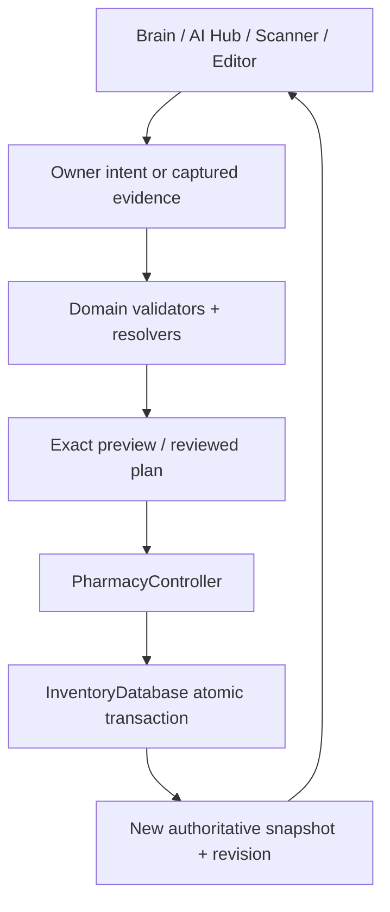
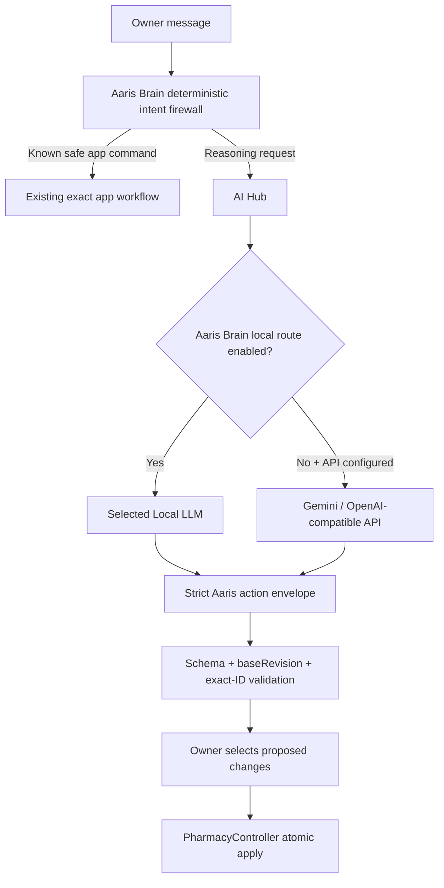
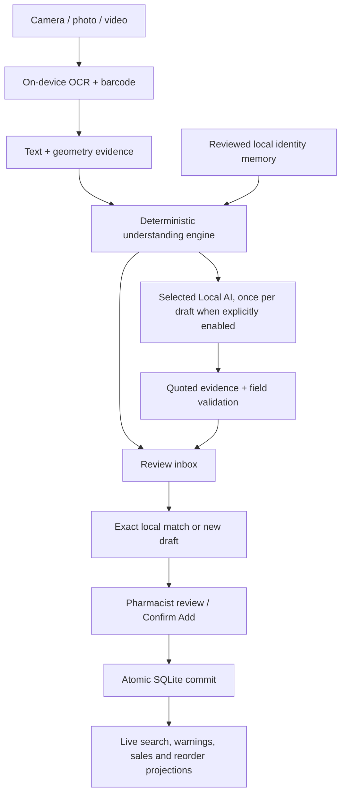
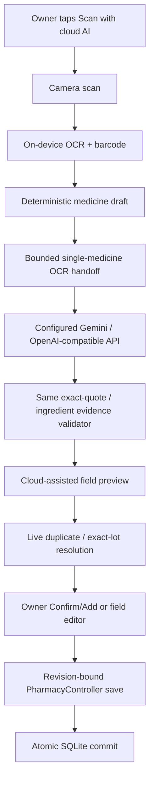

# Aaris Pharmacy — codebase tree and execution map

This is the current source map for the local-first inventory and smart-capture core.
Business rules live below `domain/`; UI screens collect intent and render reviewed
or committed state. Optional AI routes may propose facts/actions, but they never
become a second inventory authority.

| Area | Core files | Responsibility |
| --- | --- | --- |
| `lib/` | `main.dart`, `app.dart` | Bootstrap, navigation and lifecycle refresh |
| `lib/data/` | `inventory_database.dart` | Serialized atomic inventory transactions |
| `lib/domain/` | `medicine.dart`, `inventory.dart`, `tracking.dart`, `sales_overview.dart` | Validated facts, civil dates, stock projections and sales |
| `lib/domain/` | `medicine_understanding.dart`, `search.dart` | Layout, identity memory, evidence grouping and scoped matching |
| `lib/domain/` | `medicine_date_parser.dart`, `medicine_date_intelligence.dart`, `spatial_traceability.dart` | Shared validated calendar parsing; MFG/EXP roles and OCR label/value geometry |
| `lib/domain/` | `medicine_resolution_v2.dart`, `medicine_semantic_roles.dart`, `offline_evidence_graph.dart`, `offline_decision_reliability.dart` | Product-level recognition, independent evidence, ingredient roles and contradiction gates |
| `lib/domain/` | `ai_protocol.dart`, `local_ai_protocol.dart` | Reviewed mutations, paged read tools, exact IDs and evidence quotes |
| `lib/domain/` | `local_scan_handoff.dart`, `medicine_scan_commit.dart` | Evidence-only scan handoff and authoritative scan-to-stock commit gates |
| `lib/domain/` | `medicine_ocr_text.dart`, `capture_quality.dart`, `local_scan_evidence.dart` | Conservative OCR deduplication, bounded luminance sampling and complete-line source excerpts |
| `lib/domain/` | `local_model.dart`, `medicine_intake.dart` | Model manifests, persistent job state and video carry/scheduling |
| `lib/services/` | `ai_service.dart`, `local_ai_service.dart`, `local_ai_service_io.dart`, `local_ai_runtime.dart` | Explicit chat routing, model store and exclusive in-process inference |
| `lib/services/` + `lib/domain/` | `local_chat_turn.dart`, `local_context_budget.dart` | Bounded read-tool loop and fresh-chat recovery from exact native token counts |
| `lib/services/` | `local_scan_turn.dart` | Fresh scan prompts with at most four native admission attempts; exact evidence validation after re-budgeting |
| `lib/services/` | `cloud_scan_ai_service.dart` | Explicit bounded OCR handoff to the configured Gemini/OpenAI-compatible API; no inventory export/write |
| `lib/services/` | `scan_service.dart`, `media_import_service.dart`, `medicine_intake_service.dart` | Shared OCR, bounded video windows and durable local draft queue |
| `lib/services/` | `search_worker.dart`, `backup_service.dart` | Background search and explicit backup/import |
| `lib/state/` | `pharmacy_controller.dart`, `voice_search_controller.dart` | Authoritative inventory snapshot/write gateway and voice lifecycle |
| `lib/ui/` | `brain_screen.dart`, `ai_screen.dart`, `local_models_panel.dart`, `voice_sheet.dart` | Deterministic Brain, reviewed LLM chat/actions, model setup and microphone |
| `lib/ui/` | `medicine_capture.dart`, `cloud_scan_review_screen.dart`, `medicine_intake_panel.dart`, `scanner_screen.dart`, `import_screen.dart`, `editor_screen.dart` | Shared capture, explicit local/cloud lanes, draft review and explicit save |
| `android/.../` | `MainActivity.kt`, `LocalAiPlatform.kt` | Private media/file operations, window sampling, large-model import and on-device speech |
| `third_party/lib_llama_cpp/` | MIT-licensed in-process core | Audited command completion and prompt-memory reset; no server facade |
| `assets/`, `docs/`, `.github/workflows/` | Fonts, architecture/operating notes and Flutter checks/release APK gates | Bundled UI resources, maintenance map and verification before build artifacts |
| `tool/`, `test/` | Contract checks and test suites | Domain, runtime lifecycle, persistence and UI safety regressions |

## Dependency tree — authoritative write path

Neither an LLM nor scanner owns a database handle. Every stock mutation converges
on the existing controller/database gateway and is revision-bound before commit.
This is the main ripple-control boundary: AI routing can change without creating a
second persistence engine or changing dashboard/search lifecycle semantics.

## AI chat-to-inventory flow

`add`, `update`, `remove`, `mark_sold`, `restock` and supported restore actions use
this one reviewed protocol. Existing-row edits/removals require exact stock IDs;
ambiguous matches cannot be guessed. Common deterministic commands such as Add,
Open and Delete can still work without any downloaded/configured LLM.

## Normal local capture-to-save flow

No Local LLM is required for this lane. If Local AI is absent, disabled, busy with
setup, or fails validation, deterministic OCR/understanding remains a reviewable
fallback and no external provider is contacted.

The live camera preview, captured stills, photo/video inbox and explicit cloud
review all enter the same Resolver V2 safety stages. The live preview supplies
empty catalogue/private-memory inputs, so it gains spatial, regulatory, date and
cross-field contradiction checks without creating an implicit lookup or network
route.

## Explicit cloud-assisted scan flow

This lane is intentionally explicit. Saving an API key for chat does **not** make
ordinary scans upload OCR. Only the scan the owner sends through **Scan with cloud
AI** may transmit its bounded OCR handoff. The provider receives no pharmacy
inventory export, API output cannot directly write stock, failed cloud extraction
falls back to the deterministic draft, redirects are disabled, responses are
bounded, and every accepted field still has to survive source-evidence validation.

## Visual and state map

`AI Hub camera -> Capture medicine sheet -> choose local or Cloud AI -> ScannerScreen -> OCR evidence -> deterministic draft -> optional selected AI refinement -> preview -> Confirm/Add -> PharmacyController revision check -> SQLite transaction -> controller notifies -> Database/Home/Search repaint from the new snapshot.`

For conversational inventory control:

`AI composer -> deterministic Brain intercept when possible -> otherwise exactly one Local/Cloud LLM route -> strict plan parser -> before/after review cards -> owner selects changes -> atomic controller apply -> all calculated views repaint.`

## Surgical intersection points

- `medicine_date_parser.dart` is the single printed-date grammar used by the
  baseline extractor, temporal resolver and spatial OCR. Calendar validity does
  not establish the role: compact digits need MFG/EXP context before field use.
- `local_chat_turn.dart` owns history rollover; `LocalAiRuntime` owns native
  command completion. The UI only advances its history boundary after a reset
  notification, preserving the current question and already-visible messages.
- Cloud chat and scan services own requests across socket retries/backoff, not
  only while `_client` is non-null. Cancelled work drains before a new turn enters.
- `brain_screen.dart` is the deterministic-vs-LLM intent intersection. Keep it the
  single app-command firewall; do not add a parallel mutation router.
- `ai_protocol.dart` / `local_ai_protocol.dart` are the LLM-to-inventory contract.
  They remain the only way free-form model output becomes a reviewed stock plan.
- `medicine_capture.dart` is the owner-choice intersection between normal local
  capture and the explicit cloud-assisted scan lane.
- `LocalScanHandoff` + `validateLocalScan()` are the model-to-OCR-evidence
  intersection. Local and cloud extraction converge here instead of trusting a
  provider-specific schema directly.
- `medicine_ocr_text.dart` preserves differing dose/date readings instead of
  fuzzy-merging them. `LocalScanEvidence` keeps selected spans in source order,
  with explicit gaps and complete lines; field and ingredient quotes cannot
  bridge omitted text. `local_scan_turn.dart` only retries exact pre-inference
  context-budget failures, not invalid answers or cancelled work.
- `CaptureQuality` reads at most 1024 camera pixels with validated strides.
  Android photo metrics reuse the video scoring function on a bounded decode;
  missing metrics cannot suppress OCR. The original image remains unchanged.
- `medicine_scan_commit.dart` + `PharmacyController` are the final scan-to-stock
  boundary. AI previews cannot bypass duplicate/date/revision checks.

The [September 12 date/context audit](OFFLINE_CAPTURE_CONTEXT_2026_09_12.md)
records the root causes, exact changed paths, safety cases and verification limits.
The [smart-capture upgrade](SMART_CAPTURE_2026_09_12.md) records subsequent
scan admission, OCR merge and image-quality changes, verified locally with CI/APK
explicitly skipped for this delivery.

## Safety invariants

- OCR, barcode and imported text create evidence or drafts, never stock writes.
- Identity memory contains no quantity, price, location, note, batch or date and
  is not included in the cloud scan payload.
- Candidate matching is field-scoped; an exact barcode contributes only local
  facts that do not conflict across records sharing that code.
- A GTIN may identify several physical batches; batch/expiry boundaries stay
  separate and every stock record keeps an invisible stable ID.
- Duplicate frames contribute one confidence vote but retain complementary
  barcode, batch and date evidence and all source-frame IDs.
- AI Hub and ordinary video import share a durable local job queue. Completed
  drafts, unresolved video carry and cursor checkpoint together. Photos get OCR
  priority; Local AI model work is serial and yields between video windows.
- A selected Local AI route never silently falls through to an external API.
  Model search/download carries no inventory/OCR data. Independent local prompts
  reset native KV/sequence memory while keeping model weights loaded.
- The cloud scanner is a separate explicit action. A configured API key alone is
  not consent to transmit normal scanner OCR.
- Cloud scan transport receives bounded OCR for one draft, not the full Medicine
  Database, notes, stock quantities, prices, locations or sales history.
- All writes validate the expected global revision and commit atomically.
- Removed, SOLD, expired and warning screens are calculated projections, not
  copied databases.
- SQLite is authoritative. There is no Firebase, cloud-sync or server-sync path.

## Intake finalization intersection

The durable local capture queue has an intentional two-phase durability boundary:

`OCR/video evidence -> durable terminal/reasoning checkpoint -> private source cleanup -> final row checkpoint -> worker lease release -> Retry/Dismiss`

A terminal card may render after the first checkpoint, before the worker has
finished the final cleanup/write. `MedicineIntakeWorkBarrier` binds that tiny
window to the exact job ID. Retry/Dismiss wait only for that job and then enter
the existing serialized intake-write lane, preventing delete/update races without
blocking unrelated captures or adding a second queue engine. Dismissal treats
SQLite row removal as authoritative and source-file deletion as best-effort
housekeeping. The interactive cloud scan lane does not consume this durable queue,
so a full local capture queue cannot incorrectly block an explicitly requested
cloud scan.
