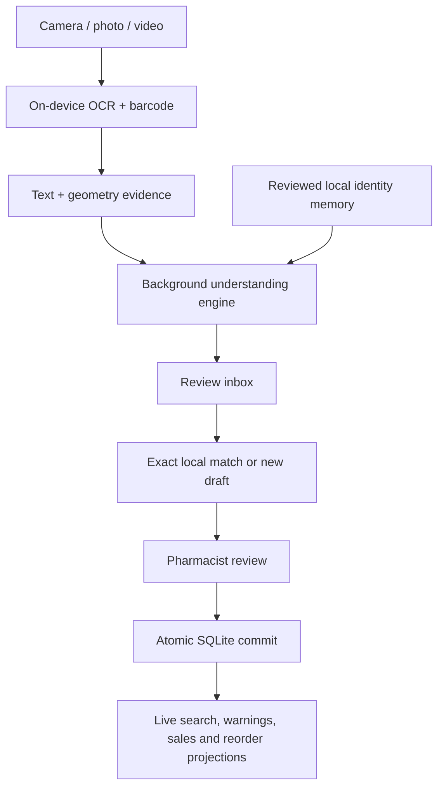

# Aaris Pharmacy — codebase tree and execution map

This is the current source map for the offline inventory and smart-capture core.
Business rules live below `domain/`; UI screens only collect intent and render
committed state.

```text
lib/
├── main.dart                         app bootstrap and SQLite ownership
├── app.dart                          navigation and lifecycle refresh
├── data/
│   └── inventory_database.dart       serialized atomic SQLite transactions
├── domain/
│   ├── medicine.dart                 validated stock facts and civil dates
│   ├── inventory.dart                status, warning scopes and totals
│   ├── search.dart                   normalized fuzzy search and ranking
│   ├── medicine_understanding.dart   layout + local-knowledge evidence resolver
│   ├── tracking.dart                 sale velocity and reorder suggestions
│   ├── sales_overview.dart           deterministic all-time sales analytics
│   ├── backup.dart                   strict local backup envelope
│   └── ai_protocol.dart              reviewed mutation envelope only
├── services/
│   ├── scan_service.dart             on-device OCR/barcode plus line geometry
│   ├── media_import_service.dart     sandboxed photo/video picker bridge
│   ├── search_worker.dart            persistent background search isolate
│   └── backup_service.dart           explicit local export/import bridge
├── state/
│   ├── pharmacy_controller.dart      one reactive snapshot and write queue
│   └── voice_search_controller.dart  bounded voice-search lifecycle
└── ui/
    ├── scanner_screen.dart           live capture and reviewed handoff
    ├── import_screen.dart            staging inbox; never direct persistence
    ├── editor_screen.dart            final human validation and save intent
    └── ...                           projections over the same snapshot

android/.../MainActivity.kt           bounded native file/video/PDF operations
test/                                 domain, persistence, lifecycle and UI guards
```

## Capture-to-save flow



Safety invariants:

- OCR, barcode and imported text create evidence or drafts, never stock writes.
- Identity memory contains no quantity, price, location, note, batch or date and
  never leaves the device.
- Candidate matching is field-scoped; an exact barcode contributes only local
  facts that do not conflict across records sharing that code.
- A GTIN may identify several physical batches; batch/expiry boundaries stay
  separate and every stock record keeps an invisible stable ID.
- Duplicate frames contribute one confidence vote but retain complementary
  barcode, batch and date evidence.
- All writes validate the expected global revision and commit atomically.
- Removed, SOLD, expired and warning screens are calculated projections, not
  copied databases.
- SQLite is authoritative. There is no Firebase, cloud-sync or server-sync path.
