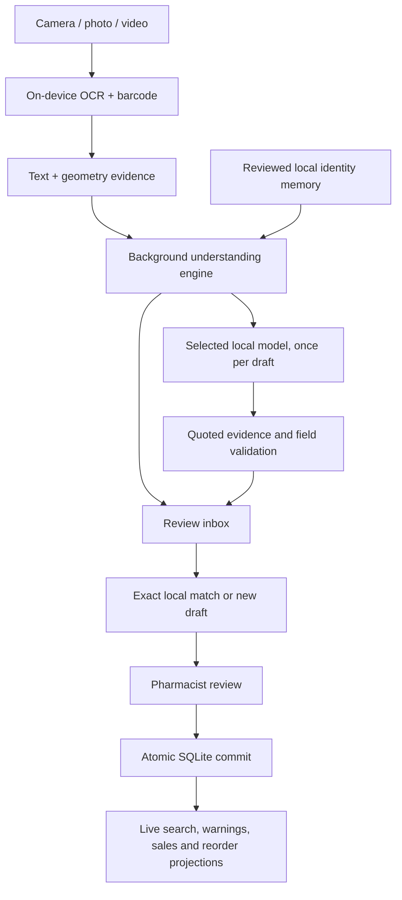

# Aaris Pharmacy — codebase tree and execution map

This is the current source map for the offline inventory and smart-capture core.
Business rules live below `domain/`; UI screens only collect intent and render
committed state.

| Area | Core files | Responsibility |
| --- | --- | --- |
| `lib/` | `main.dart`, `app.dart` | Bootstrap, navigation and lifecycle refresh |
| `lib/data/` | `inventory_database.dart` | Serialized atomic inventory transactions |
| `lib/domain/` | `medicine.dart`, `inventory.dart`, `tracking.dart`, `sales_overview.dart` | Validated facts, civil dates, stock projections and sales |
| `lib/domain/` | `medicine_understanding.dart`, `search.dart` | Layout, identity memory, evidence grouping and scoped matching |
| `lib/domain/` | `ai_protocol.dart`, `local_ai_protocol.dart` | Reviewed mutations, paged read tools, exact IDs and evidence quotes |
| `lib/domain/` | `local_model.dart`, `medicine_intake.dart` | Model manifests, persistent job state and video carry/scheduling |
| `lib/services/` | `ai_service.dart`, `local_ai_service.dart`, `local_ai_service_io.dart`, `local_ai_runtime.dart` | Explicit local routing, model store and exclusive in-process inference |
| `lib/services/` | `scan_service.dart`, `media_import_service.dart`, `medicine_intake_service.dart` | Shared OCR, bounded video windows and durable draft queue |
| `lib/services/` | `search_worker.dart`, `backup_service.dart` | Background search and explicit backup/import |
| `lib/state/` | `pharmacy_controller.dart`, `voice_search_controller.dart` | Authoritative inventory snapshot/write gateway and voice lifecycle |
| `lib/ui/` | `ai_screen.dart`, `local_models_panel.dart`, `voice_sheet.dart` | Existing AI Hub, model search/download/import/activation and microphone |
| `lib/ui/` | `medicine_capture.dart`, `medicine_intake_panel.dart`, `scanner_screen.dart`, `import_screen.dart`, `editor_screen.dart` | Shared capture, Add/Ask/Edit draft review and explicit save |
| `android/.../` | `MainActivity.kt`, `LocalAiPlatform.kt` | Private media/file operations, window sampling, large-model import and on-device speech |
| `third_party/lib_llama_cpp/` | MIT-licensed in-process core | Audited command completion and prompt-memory reset; no server facade |
| `tool/`, `test/` | Contract checks and test suites | Domain, runtime lifecycle, persistence and UI safety regressions |

## Capture-to-save flow

Safety invariants:

- OCR, barcode and imported text create evidence or drafts, never stock writes.
- Identity memory contains no quantity, price, location, note, batch or date and
  never leaves the device.
- Candidate matching is field-scoped; an exact barcode contributes only local
  facts that do not conflict across records sharing that code.
- A GTIN may identify several physical batches; batch/expiry boundaries stay
  separate and every stock record keeps an invisible stable ID.
- Duplicate frames contribute one confidence vote but retain complementary
  barcode, batch and date evidence and all source-frame IDs.
- AI Hub and ordinary video import share a durable job queue. Completed drafts,
  unresolved video carry and cursor checkpoint together. Photos get OCR priority;
  model work is serial and yields between video windows.
- A selected local model never falls through to an external API. Model search
  and download carry no inventory/OCR data. Independent prompts reset native
  KV/sequence memory while keeping model weights loaded.
- All writes validate the expected global revision and commit atomically.
- Removed, SOLD, expired and warning screens are calculated projections, not
  copied databases.
- SQLite is authoritative. There is no Firebase, cloud-sync or server-sync path.

## Intake finalization intersection

The capture queue has an intentional two-phase durability boundary:

`OCR/video evidence -> durable terminal/reasoning checkpoint -> private source cleanup -> final row checkpoint -> worker lease release -> Retry/Dismiss`

A terminal card may render after the first checkpoint, before the worker has
finished the final cleanup/write. `MedicineIntakeWorkBarrier` binds that tiny
window to the exact job ID. Retry/Dismiss wait only for that job and then enter
the existing serialized intake-write lane, preventing delete/update races without
blocking unrelated captures or adding a second queue engine. Dismissal treats
SQLite row removal as authoritative and source-file deletion as best-effort
housekeeping.
