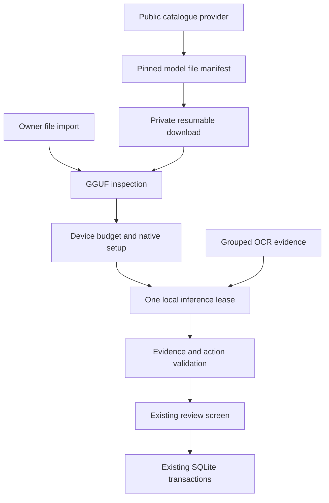

# Local AI architecture upgrade — 9 September 2026

This extends the existing Aaris Pharmacy implementation from `931e488`. The
single SQLite inventory, existing AI Hub, deterministic scanner, reviewed action
protocol, and durable video/photo inbox remain authoritative.

## Findings and implemented changes

| Finding | Change | Boundary |
| --- | --- | --- |
| Search stopped at 30 popular models | Live 50-result pages; popular, trending, newly created and recently updated ordering; deduplicated Load more | 500 results per UI search; narrow the query to explore further |
| New/untagged repositories and file URLs were awkward | Exact repository, tree, blob and resolve links; named refs resolve to immutable revision metadata | Only explicit public Hugging Face metadata; no pharmacy text in requests |
| Unsupported artifacts disappeared silently | Counts explain split GGUF, projector/adapter, other formats and missing hashes | A new provider can implement `ModelCatalogueProvider`; only Hugging Face ships today |
| Interrupted transfer required rediscovering the exact file | Durable download tickets store filename, bytes, revision and SHA-256 before transfer | Resume verifies range/length/hash; removal only targets that ticket's partial file |
| A 24-byte GGUF magic check admitted malformed/companion files | Bounded off-isolate metadata/tensor-directory inspection, version/count/dimension/alignment/offset checks | Native loader still verifies architecture, quantization and actual tensor payload |
| Every model allocated an 8192-token context | Weight + KV + workspace/scan reserve budgeting, current available RAM admission, 4096/2048 phone context and up to 8192 elsewhere | Conservative estimate, not a successful allocation or performance guarantee |
| CPU prompt batching could compete heavily with camera/OCR | Bounded threads and prompt microbatches in the vendored native core | CPU inference remains the installed runtime |
| Character limits did not reserve output tokens | Actual tokenized input plus output reservation checked before native prompt evaluation | Oversized requests fail explicitly; never truncate a purported complete JSON result |
| Individual tokens were decoded as complete UTF-8 | Stateful strict UTF-8 decoding across native token pieces | Incomplete/invalid output fails instead of corrupting Hindi/Urdu/medicine text |
| Concurrent disposal and failed load attempts could corrupt runtime state | One disposal future, closing admission guard, guarded load state, terminal transport errors poison the runtime | Native cancellation still drains the current bounded step |
| Two setup examples did not exercise dose precision | Five versioned format probes including unknowns, decimals, liquid denominator and source instructions | Setup checks are not a pharmacy accuracy score |
| Quote validation accepted evidence beyond the text sent to the model | One shared bounded excerpt for prompting and quote authority | Full raw evidence and deterministic fields remain in the draft |
| Salt/strength proposals could disagree or crop a denominator from a quote | Adjacent pair requirements, consistent paired/flat representations, exact dose/unit/denominator checks and full printed-dose boundaries | Changes remain review-needed and dates remain deterministic |
| Memory pressure did not stop background model pressure | Capture queue pauses; local result is cancelled and loaded model released after its lease drains | Selected model and saved drafts survive; user can resume |

## Extension and trust boundaries



Model names and families are not a static execution allowlist. New models can be
discovered immediately, but a new architecture or quantization may require a
reviewed app/runtime update. A `.gguf` suffix, publisher tag, download count or
successful file hash is not proof of runtime compatibility or medical quality.
Installed metadata and setup build identity are additive manifest fields; old
version-1 installations and existing pending capture records remain readable.

Image/audio/projector runtimes, split-model assembly, ONNX/LiteRT/MLX execution,
gated authentication and additional catalogue providers are explicit extension
work, not simulated support. The currently selected local model receives grouped
OCR text; it does not directly watch raw video. No model-supplied executable code,
native library, remote Python or arbitrary HTTP inference server is loaded.

The code does not invent a specialist pharmacy corpus or advertise clinical
qualification. Pharmacist-reviewed inventory remains the local identity
reference. MFG/EXP chronology, quantities, MRP versus cost, retrieved-ID authority,
revision/replay checks, and final inventory approval remain deterministic.

## Verification

Run with a working Dart SDK and the repository's resolved dependencies:

```sh
dart analyze lib test tool third_party/lib_llama_cpp/lib
dart tool/check_model_catalogue.dart
dart tool/check_model_preflight.dart
dart tool/check_local_ai.dart
dart tool/check_local_ai_runtime.dart
dart tool/check_domain.dart
dart tool/check_date_input.dart
dart tool/check_medicine_understanding.dart
```

At the second checkpoint all **344 assertions passed**: catalogue 23,
preflight/setup 134 (including 100 malformed header inputs), local AI 65, runtime
lifecycle/text 21, domain 52, dates 25 and understanding 24. Analysis is clean.
Catalogue tests use a controlled HTTP transport; GGUF tests use synthetic files.
The lifecycle suite exercises controlled command streams and the actual worker's
missing-library path, not a loaded model's semantic accuracy.

Full Flutter widget/device tests could not start: the installed Flutter SDK has
no usable tester artifacts and its tool dependencies are incomplete. The bundled
Dart executable in one SDK also segfaults; standalone Dart 3.13.2 runs the source
analysis and contracts. No APK build or CI workflow was requested or run.

Physical Android acceptance remains necessary for actual GGUF loading, available
RAM/thermal behavior, model speed, tokenizer/template variants, camera/OCR/voice,
interrupted downloads, process death, low-storage recovery, and representative
medicine labels. Do not claim universal compatibility, big-tech equivalence,
clinical accuracy or complete video recall from source tests.

## Primary implementation references

- [Hub API](https://huggingface.co/docs/hub/api) and
  [Hub client metadata/search interface](https://huggingface.co/docs/huggingface_hub/package_reference/hf_api)
- [GGUF container specification](https://github.com/ggml-org/ggml/blob/master/docs/gguf.md)
- [llama.cpp multimodal boundaries](https://github.com/ggml-org/llama.cpp/blob/master/docs/multimodal.md)
- Installed `lib_llama_cpp` / platform / FFI source, all pinned to 0.7.3

GitHub checkpoints use `[skip ci]`, preserve owner changes, and never force-push.
First discovery checkpoint: `7c3dbfd` on `main`.
