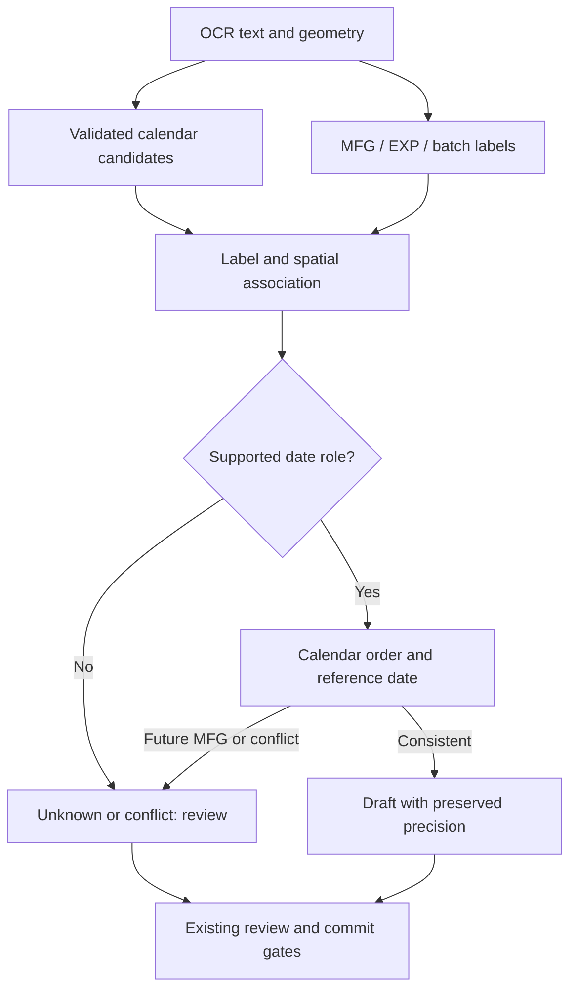
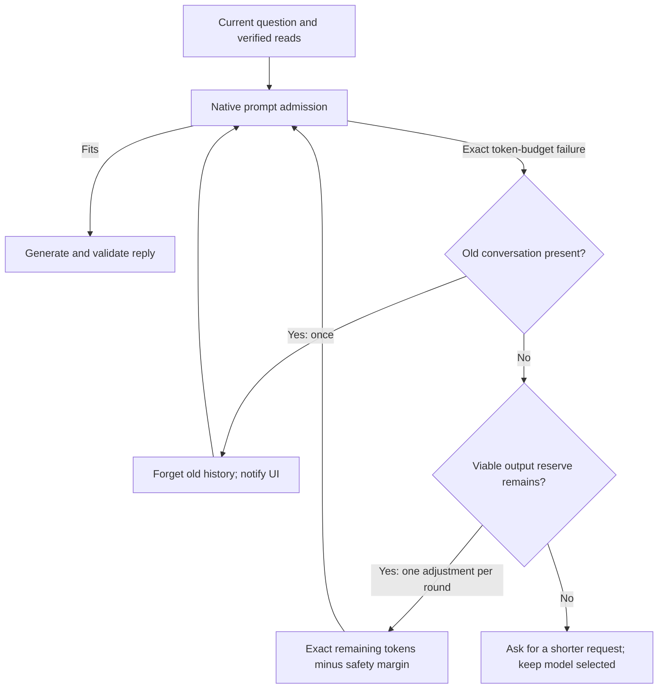

# Offline medicine dates and bounded Local AI conversations

Scope: compact manufacturing-date recognition, no-model scan/photo recognition,
repeated Local AI turns, cloud request ownership and regressions. No new external
provider, downloaded medicine dictionary, model dependency or database migration
is introduced. See [CODEBASE_TREE.md](CODEBASE_TREE.md) for the application map.

## Code and user-state intersection

| User journey | Execution / state path | Changed intersection and ripple effect |
| --- | --- | --- |
| Live camera or photo upload | `ScannerScreen` / `MedicineIntakeService` → `MedicineVisionService` → text, bounding boxes, barcode → Resolver V2 | Shared calendar parser now reaches baseline, spatial and temporal stages; a recognized MFG reaches the existing review draft instead of remaining a bare number |
| Medicine identity without AI | Printed composition + reviewed shop memory + optional local canonical catalogue → semantic/product conflict checks → `MedicineScanDraft` | Salt and strength remain separate evidence-backed fields. An unseen brand does not authorize guessing paracetamol or a dose |
| Confirm/Add | Draft → exact-lot/duplicate and field review → `PharmacyController` → atomic `InventoryDatabase` revision → UI snapshot | No alternate writer; canonical date and month-only precision continue through the existing `Medicine` JSON contract |
| Local chat | `AiScreen` → `AiService` → exclusive `LocalAiService` → `runLocalChatTurn` → `LocalAiRuntime` → native llama.cpp | Exact admission failure clears old conversation and retries the current request. UI excludes old bubbles from later local prompts while leaving them visible |
| Explicit cloud chat / scan | Configured HTTPS route → owned request → bounded response → existing plan/evidence validation | Ownership now includes retry gaps and cancellation cleanup; a second request cannot steal an older turn's transport |

## Date bug and replacement

The baseline and V10 temporal parser had separate calendar grammars. A labelled
`05042027` was not parsed as a full date. Spatial extraction delegated to the
same incomplete temporal parser, so geometry alone could not repair it.

`medicine_date_parser.dart` replaces these duplicate grammars. In a supported
date-valued context it understands:

| Printed / OCR value | Canonical field | Precision / guard |
| --- | --- | --- |
| `MFG 05042027`, `MFG05042027`, `M.F.G. 05 04 2027` | `2027-04-05` | Full day, India-facing DDMMYYYY |
| `Manufacturing Date` followed by a value-only line `05042025` | `2025-04-05` | Immediate unambiguous label association |
| `EXP 20280406` | `2028-04-06` | Four-digit leading year |
| `MFD 042025`, `MFG APR 2025`, `MFG 2025-04` | `2025-04` | Month only, no invented day |
| Devanagari digits / bounded `O`→`0`, `I`/`l`→`1` OCR confusions | Validated canonical date | Character positions stay aligned with label offsets |
| `31022027`, `32/02/2027` | No date | Invalid full span cannot be salvaged as a month/year tail |
| `Batch 05042027`, an unlabelled compact number, digits inside a GTIN | No assigned date field | Numeric appearance is not sufficient evidence |

Separated day/month/year, ISO dates, month names and comma/slash/dot/space
separators remain supported. Compact values require a four-digit year in
2000–2099; ambiguous DDMMYY is not guessed. GS1 YYMMDD remains the responsibility
of the existing GS1 Application Identifier decoder, not this printed-date parser.

Competing explicit dates with no common calendar interval remain conflicted even
if a plausible chronological pair exists. A GS1 full day and a printed month
containing it are consistent, not a false conflict; two different full days are
still a conflict even if a broad month overlaps both. Duplicate text/layout observations in one frame do not manufacture
extra support. A single unlabelled future date is a low-confidence review hint,
not auto-filled expiry. With a reference date of 2026-09-12, the reported
`MFG 05042027` is recognized correctly but marked for review because manufacture
is in the future; it is never silently renamed expiry. Resolver V2 accepts an
optional reference date and otherwise captures the clock once per resolver.

## Why another chat can recover a context failure

The native runtime already calls `llama_memory_clear(memory, true)` before
evaluating each complete prompt. The problem addressed here is older messages
being sent back in the next full prompt. Previously, history was bounded only
by characters, and the native token-budget error became an ordinary `StateError`.
This explains a reproducible context-overflow failure path, not every possible
cause of a device's “unavailable” message or evidence of a corrupted model file.

- `LocalContextBudgetFailure` recognizes only the vendored pre-evaluation error
  with actual input/output/context counts. Allocation failures, cancellation,
  invalid models and malformed replies are not disguised as context overflow.
- The existing native lease stays exclusive and drains Error → Done before
  retry. A healthy loaded model is not unloaded merely to forget history.
- The current question, system constraints and current-turn verified tool facts
  are never truncated. Large history resets as a whole, including Unicode text.
- Native counts—not the model's advertised maximum—bound a reduced output
  reserve. If even a fresh prompt cannot fit with a viable answer, the owner gets
  a narrower-request error rather than an endless retry or “model unavailable”.
- The existing four-read limit and two-result retention remain. Stream state is
  cleared between tool rounds and retries. Cancellation stops further attempts.
- `AiService` retains the reset history boundary if a separate transport recovery
  later retries the same turn. The UI visibly explains what was forgotten.

## Connectivity and privacy

Local mode still never silently sends data to cloud. Cloud chat uses the explicit
inventory export; cloud scan receives only its bounded OCR handoff, no inventory
export. API keys remain in existing secure storage. Redirects stay disabled.

Both cloud services now retain a request-lifetime ownership flag while a failed
socket is closed during backoff. Cancel invalidates the request epoch; ownership
is released only in final cleanup. HTTP client factories allow controlled tests
of actual request construction, retry, endpoint validation and cancellation.

The baseline main build also had a stale source assertion for capture privacy
copy. The test now checks the current bounded-evidence/inventory-local message
and the existing Confirm/Add review requirement. No privacy check was removed.

## Verification and limits

This section describes the earlier date/chat change. For the subsequent
scan/photo upgrade and its explicitly local-only, CI/APK-skipped verification,
see [SMART_CAPTURE_2026_09_12.md](SMART_CAPTURE_2026_09_12.md).

Standalone checks run with Dart 3.13.2:

- `dart tool/check_offline_capture_context.dart`: compact/invalid/Unicode dates,
  all month boundaries across seven representative years in both compact orders,
  no-model composition, draft/Medicine date round-trip and bounded chat recovery.
- Existing `check_medicine_understanding.dart`, `check_domain.dart`,
  `check_date_input.dart`, `check_local_ai.dart`, `check_default_local_ai.dart`,
  `check_model_preflight.dart`, and `check_model_catalogue.dart` passed.
- Analyzer of `lib/domain`, `local_chat_turn.dart` and the new standalone contract
  reported no issues; `git diff --check` passed.

Added Flutter tests cover both Gemini/OpenAI-compatible chat and scan request
shapes, streaming capability fallback, auth failure, retry-gap ownership and
cancellation; an injected native command stream exercises eight sequential chats
with two context rollovers and one model load. These are controlled contract
tests, not live provider calls or real GGUF inference benchmarks.

Full Flutter dependency resolution was unavailable locally because the offline
cache lacked pinned app packages. The existing GitHub checks/release workflows
remain the full analyzer, Flutter regression and Android-build gates. Their run
status must be checked for the published commit; no successful APK is asserted by
the standalone checks above.

Still requiring physical-device validation: the owner's exact Gemma 3 1B GGUF,
phone RAM/thermal behavior, repeated camera/gallery OCR and a real configured
cloud endpoint. No universal medicine-recognition accuracy, hardware stability
or zero-future-bug claim is made. Unreadable/ambiguous packs require review.

## Primary references checked

- [Gemma 3 model card](https://ai.google.dev/gemma/docs/core/model_card_3):
  the 1B model has a 32K context maximum; input consumes part of the shared budget.
  The application's loaded native context can be smaller, so exact admission
  counts drive recovery.
- [ML Kit Android text recognition](https://developers.google.com/ml-kit/vision/text-recognition/v2/android):
  the existing on-device Latin/Devanagari OCR path supplies text and geometry;
  image quality still constrains extraction.
- [GS1 2D retail guideline](https://ref.gs1.org/guidelines/2d-in-retail/):
  date semantics belong to their Application Identifier. Printed-date heuristics
  must not reinterpret arbitrary barcode digits as MFG or EXP.
- Repository-native implementation: `third_party/lib_llama_cpp/lib/src/native_runtime.dart`
  and `context_budget.dart` are the source of truth for KV reset and exact prompt
  admission behavior used by this change.
