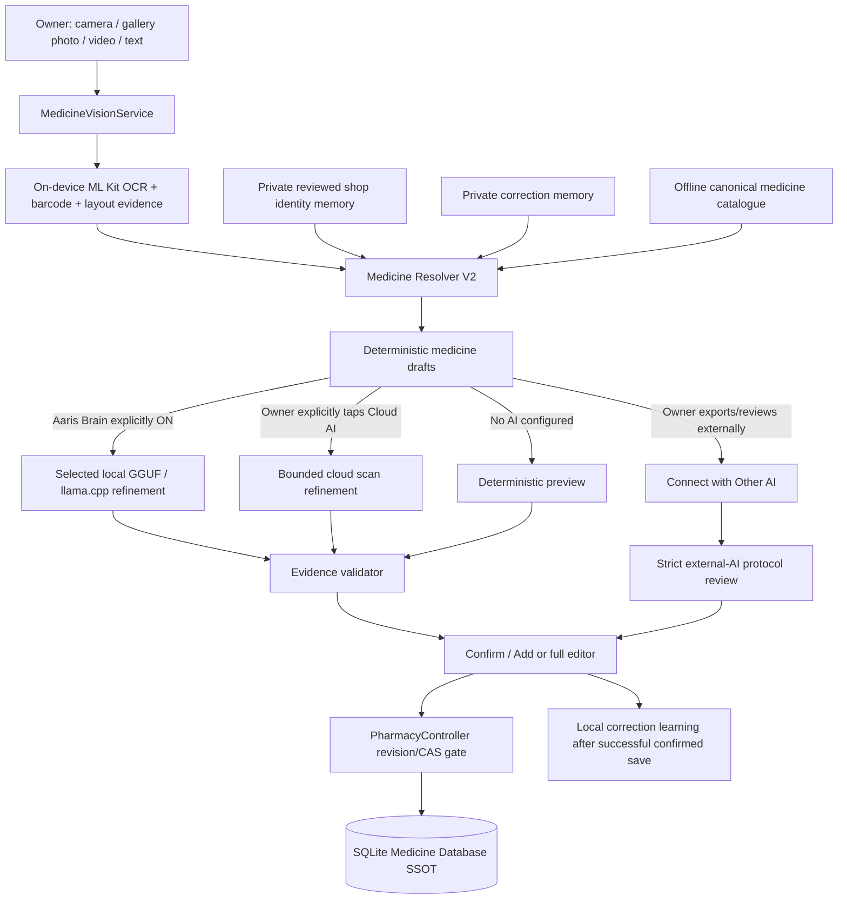

# Aaris Pharmacy — Scan Intelligence Architecture Upgrade (2026-09-12)

## Goal

Make medicine capture equally strong whether the owner uses no AI, a local GGUF model, an explicitly configured cloud model, or the existing Connect with Other AI workflow, without creating a second inventory authority or a silent network dependency.

## Dependency tree

## Visual/state map

1. User captures a live camera frame, chooses a gallery photo, queues rapid photos/video, or imports text.
2. Barcode and OCR evidence are extracted locally. Raw images/video never become inventory facts.
3. Resolver V2 performs product-first grouping, counterfactual variant safety, date/strength/form validation and bounded local retrieval.
4. Routing is explicit and mutually understandable:
   - **Offline Core:** deterministic draft only; no model/API/network required.
   - **Local AI:** selected GGUF may refine the evidence-grounded draft when Aaris Brain is enabled.
   - **Cloud AI:** only an explicit cloud camera/photo action or an explicit `Cloud refine this draft` tap may send bounded OCR evidence.
   - **Connect with Other AI:** stays a reviewed export/import lane; it never writes inventory directly.
5. Every probabilistic route returns a proposal. Exact evidence validation and the existing review UI remain authoritative.
6. Confirm/Add re-resolves against live inventory and writes through PharmacyController using the existing revision/CAS boundary.
7. Only after that save succeeds may the local correction memory learn the pharmacist-confirmed identity.

## Surgical targets upgraded

### 1. Cloud lane now uses the same Resolver V2 safety engine

The old cloud review screen entered the legacy deterministic understanding path even though direct scan and durable import already used Resolver V2. This split could make the explicit cloud lane weaker before any provider request was made.

The cloud screen now uses `understandMedicineEvidenceV2Message`. When a valid cloud configuration exists, private shop identity memory, private correction memory and the offline canonical catalogue are deliberately excluded from the provider-bound draft. This preserves the promise that explicit cloud refinement is derived from the selected capture, not from the owner's private inventory.

If cloud configuration is missing or invalid, no network request occurs and the fallback can safely use private local knowledge plus the offline canonical catalogue because the data never leaves the device.

### 2. Gallery photo gets a first-class explicit Cloud AI lane

`Capture medicine` now offers **Choose photo · Cloud AI**. The selected gallery image is read by the same local OCR/barcode engine used by live camera capture. The temporary picker file is cleaned before cloud review; only bounded extracted evidence reaches the cloud-review screen.

This removes the previous asymmetry where camera had an explicit cloud route but gallery photo could only enter the local durable queue.

### 3. Durable photo/video drafts can be cloud-refined later

Every terminal draft in the saved intake panel now has **Cloud refine this draft**. The action does not forward the enriched durable draft because it may contain candidates learned from private shop memory. Instead it reconstructs fresh cloud-review evidence from the draft's original raw OCR plus barcode and lets the cloud screen rebuild a privacy-bounded Resolver V2 draft.

This gives long-running/resumable photo and video imports access to cloud reasoning without turning cloud into an automatic fallback and without changing the durable queue schema.

### 4. Confirmed cloud scans now improve future offline recognition

A successful cloud-assisted Confirm/Add now feeds the same local correction-memory learning boundary as confirmed local/import scans. Learning happens only after the revision-checked inventory save succeeds. Raw cloud traffic is not stored in correction memory.

## Route invariants

- SQLite remains the single source of truth.
- AI never writes SQLite directly.
- No silent cloud fallback occurs when Local AI is selected or busy.
- A saved API key is not scan consent.
- Cloud scan is an explicit owner action.
- Private inventory/correction memory is excluded from provider-bound deterministic construction.
- Cloud and Local AI outputs remain evidence-validated proposals.
- Offline Core continues to work when all AI routes are absent.
- Connect with Other AI remains compatible because its strict reviewed protocol is unchanged.
- Existing duplicate, batch, expiry, chronology, revision/CAS, editor, audit and confirmation boundaries remain authoritative.

## Web research applied

The design follows current Android/ML Kit guidance to keep OCR/barcode extraction on-device where possible, GS1 healthcare practice for structured product/lot/expiry evidence, and current llama.cpp Android guidance to keep local inference device-aware and bounded. Hybrid inference is implemented as an explicit routing policy rather than as a hidden fallback or a second database authority.

## Verification boundary for this checkpoint

This is a source-only architecture/code checkpoint. No CI workflow, analyzer, test suite, APK build, model download or physical-device camera run is triggered by this commit. Device acceptance remains required for camera focus, gallery picker behavior, provider networking and low-memory vendor behavior.
