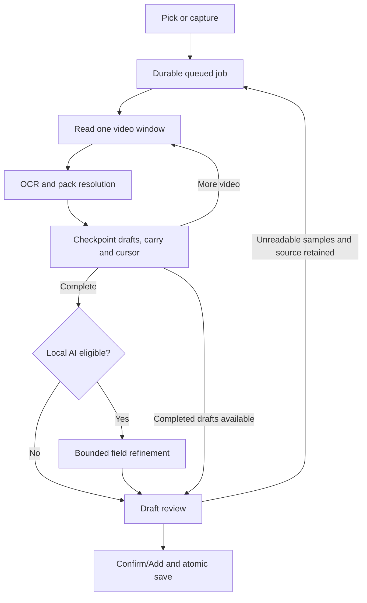

# Video medicine recognition audit and repair

Inspected base: `531baf0e940c6df08569e777b1681069e4b33b2c` on
`warishakhan3548-hash/updating-repository/main`. Changes build on that restored
version. No earlier reverted UI/routing commits are replayed.

## Dependency tree and execution map

| Layer | Entry / owner | Downstream responsibility |
| --- | --- | --- |
| Bootstrap | `main.dart`, `app.dart`, `PharmacyController` | Inventory snapshot, navigation and lifecycle |
| Capture UI | `medicine_capture.dart`, `scanner_screen.dart`, `import_screen.dart` | Camera evidence or app-private copied photo/video |
| Durable intake | `MedicineIntakeService.enqueueSource`, `_pump` | SQLite job acknowledgement, one worker lease, resumable checkpoints |
| Android video | `MainActivity.sampleVideoWindow` → `sampleVideo` | Entire timeline in 20-second windows, bounded image files with timestamps |
| Vision | `MedicineVisionService.analyzeFile` | Local Latin/Devanagari OCR, geometry and barcode evidence |
| Baseline grouping | `MedicineUnderstandingEngine.understand` | Prepare → semantic duplicate checks → pack boundaries → field fusion |
| Product resolution | `understandMedicineEvidenceV2Message` | Local identity memory, spatial/regulatory/date/ingredient checks and coherent product hypotheses |
| Window completion | `finishMedicineVideoWindow` | Emit completed packs once; keep unresolved evidence with the next cursor |
| Optional Local AI | `_reason` → `runLocalScanTurn` → `validateLocalScan` | Capture-bound model lease, bounded prompt recovery, exact source validation |
| Explicit Cloud API | `CloudScanReviewScreen` → `CloudScanAiService.refine` | Per-draft OCR-only request, shared evidence validation, original draft on failure |
| Review | `MedicineIntakePanel` → `ImportInboxScreen` / editor | Snapshot of ready drafts, conflict review, Confirm/Add |
| Save | `PharmacyController` → `InventoryDatabase` | Revision-checked inventory writes; dashboard/search remain calculated views |

Local/cloud configuration now lives once in `domain/ai_configuration.dart`;
`ai_service.dart` re-exports it for existing callers. The class was moved verbatim.
Cloud extraction no longer imports the chat/local-runtime implementation to use
the configuration type.

## UI and state map

The user can preview completed drafts while later windows or Local AI are still
processing. The review screen receives a copied list. Quick-add eligibility and
the authoritative inventory revision checks are unchanged. Video progress shows
elapsed/total video time and medicine count; AI refinement uses its own progress.

## Reproduced faults and original-code fixes

1. **Forgotten pack identity.** Only the four most recent prepared views anchored
   grouping. A Dolo front followed by MFG, EXP, batch, MRP and manufacturer views,
   then an Azithral front, produced one Azithral draft carrying Dolo's lot/date.
   Identity/lot anchors now use the entire bounded unresolved group.
2. **Similar-name products merged before validation.** ALPHA COLD / Paracetamol
   and ALPHA GOLD / Metformin became one draft. Grouping and duplicate admission
   now share boundary checks, compare explicit brand evidence and account for
   contradictory ingredient/dose evidence. Partial composition views still fuse.
3. **Valid boundaries erased.** A single unnamed back with a different lot/date
   was merged into its predecessor by `_repairWeakBoundaries`. That repair and
   its helper were removed. Unknown names stay blank in separate review drafts.
   High-confidence one-character lot differences are also kept separate.
4. **Completed pack replay.** The transition tail included frames already emitted
   as completed drafts. Those sequences are now excluded before carry selection.
5. **Middle panel loss.** Head/tail-only truncation could drop the only expiry or
   composition reading during a slow pan. Bounded carry retains its first anchor,
   recent transition tail and views adding distinct OCR/barcode evidence.
6. **Pre-OCR rejection.** A coarse thumbnail hash/quality score discarded frames
   without testing their readable text. Native sampling now provides up to 40
   samples per 20 seconds, retains low-quality samples for OCR and allows at most
   12 nearby rescue decodes per window. Images are bounded to a 1920-pixel long
   edge. Hash-based pre-OCR discard code was removed. A native decoder lease
   prevents a retry from overlapping decoding still running after a Dart timeout.
7. **Invisible coverage failures and EOF retry.** Empty OCR and native decoder
   failures are counted and persisted separately from Local AI errors. Incomplete
   captures retain the original video until explicit rescan/dismiss. Retrying an
   empty failed video restarts at zero; explicit rescan clears the prior pass's
   drafts/carry before rereading. Old jobs default the new counter to zero.
8. **Unbounded slow cloud body.** An inactivity timeout reset after every chunk.
   Response reading now has a total deadline, byte cap and cancelled stream
   subscription on exit. Existing bounded retry/route ownership remains intact.

Native responses are validated before checkpointing: progress must advance within
duration, frame timestamps must belong to that window, sequence IDs must be
unique and numeric metadata must be valid. Invalid windows cannot silently move
the cursor past lost evidence.

## Verification

- `tool/check_video_medicine.dart`: **15 passed**, including a three-minute
  synthetic OCR timeline containing 18 physical lots, emitted exactly once.
- Focused Flutter run: **166 tests passed** across video recognition, native
  channel response contracts, cloud body bounds, intake concurrency, existing
  medicine understanding, offline capture/context, scan handoff and Resolver V2.
- Focused analyzer: no issues in changed domain/media/cloud logic and new tests.
- Shared AI configuration move checked byte-for-byte against the original class.
- Diff whitespace check passed. No workflow files changed; commit uses `[skip ci]`.

Tests used copied, unchanged production sources in an isolated cached Flutter
harness because the full pinned dependency install was blocked at `pub.dev`.
The harness uses an unused secure-storage stub; HTTP and native method channels
are mocked. It does not validate Android Keystore, a real API provider, native
video decoding, the full intake widget, or on-device model execution. No APK,
CI workflow, model download or paid inference was run.

The user's original video was not provided. The tests establish the reproduced
code failures and deterministic improvements; they do not establish a measured
real-camera accuracy percentage. Phone acceptance still needs the reported
two-pack clip and a two/three-minute clip with front/back/date panels. Tiny,
blurred, occluded or very briefly visible labels may remain unreadable, and
simultaneously overlapping packs can still require separate captures/review.

## Design references

- [Android MediaMetadataRetriever](https://developer.android.com/reference/android/media/MediaMetadataRetriever): nearest-frame retrieval and scaled decoding. Per-window rescue is bounded because non-key-frame decoding can cost more.
- [ML Kit text recognition input guidance](https://developers.google.com/ml-kit/vision/text-recognition/v2/android): adequate character pixels and focus matter; a global image-quality score cannot certify OCR readability.

## Reapply the repair

`python3 tool/apply_video_medicine_fix.py /path/to/aaris-pharmacy`

The complete script carries this source/test/documentation patch, verifies the
expected original file hashes before editing, recognizes an already applied
repair, rejects divergent targets and uses Git's checked patch application. It
does not build, contact providers, change inventory or push on its own.
